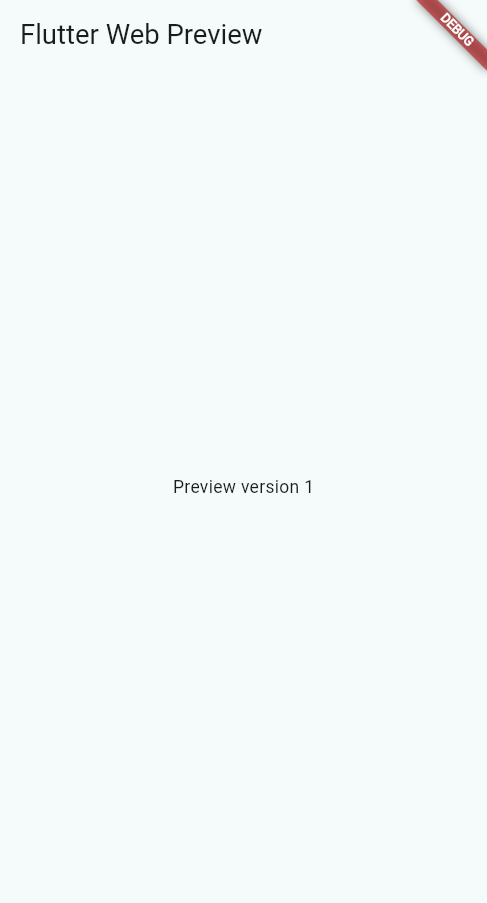
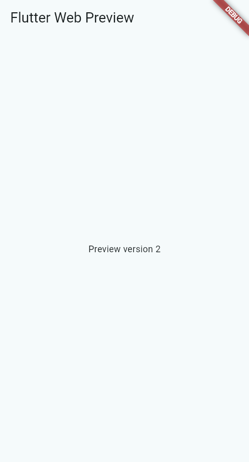

# Flutter Web Preview

**在 VS Code 右侧预览 Flutter Web：启动一次，保存更新，关闭停止。**

Flutter Web Preview 是面向本地 Windows 开发的 VS Code 扩展。它将 Flutter 应用打开在编辑器内置的 Integrated Browser 中，让你在修改 Dart 界面时直接查看结果，无需切换到外部 Chrome。

- **保存即更新**：支持手动保存和 Auto Save；连续保存会合并更新请求，编译完成后刷新页面。
- **预览管理服务**：首次手动启动，关闭预览标签后停止对应 Flutter 服务并释放端口；之后保存文件不会重新启动。
- **编译失败可恢复**：保留上一次成功的页面，修复错误并保存后继续更新；状态栏和 Output 提供运行状态与日志。
- **应用日志可见**：自动连接预览浏览器，`print`、`debugPrint` 和 `dart:developer.log` 显示在调试控制台，包含点击和异步回调产生的输出。
- **退出结果明确**：关闭预览或停止日志会话后，确认清理完成再输出一次 `exit`；停止失败会显示失败信息，供重试。

[快速开始](#快速开始) · [应用日志与退出提示](#应用日志与退出提示) · [配置](#配置) · [常见问题与支持范围](#常见问题与支持范围) · [开发与验证](#开发与验证) · [English](#english-quick-start)

## 快速开始

### 环境要求

| 环境 | 要求 |
| --- | --- |
| 操作系统 | 本地 Windows |
| 编辑器 | VS Code 1.140.0 或以上，支持 Integrated Browser |
| Flutter | 3.35 系列或以上的 stable SDK |
| 项目 | Flutter 应用，包含 `pubspec.yaml`、`lib/` 和 `web/`，并已信任工作区 |

首次运行前，在你的 Flutter 项目根目录执行：

```powershell
flutter pub get
```

### 安装扩展

当前使用 VSIX 安装。已有 `flutter-web-preview-0.1.1.vsix` 时，在 VS Code 命令面板执行 **Extensions: Install from VSIX...** 并选择该文件。

从旧版本更新时，先执行 **Stop Web Preview**，再通过 **Install from VSIX...** 选择新版安装包；安装完成后执行 **Developer: Reload Window**，重新运行预览即可使用新功能。

也可以从源码生成安装包。下载或克隆本仓库后，在仓库根目录执行（建议使用 Node.js 24，与 CI 配置一致）：

```powershell
npm ci
npm run package
```

安装包输出到 `artifacts/flutter-web-preview-0.1.1.vsix`。Marketplace 发布准备见[发布说明](docs/marketplace.md)。

### 开始预览

1. 在 VS Code 中打开并信任你的 Flutter Web 项目。
2. 打开入口 Dart 文件，点击顶层 `main()` 上方的 **Run Web Preview**；也可在命令面板执行 **Flutter Web Preview: Run Web Preview**。
3. 修改并保存当前项目中的 Dart 文件，右侧预览在编译成功后自动刷新。
4. 关闭预览标签结束会话，再次点击 **Run Web Preview** 可重新启动。

多根工作区支持选择项目，每个 VS Code 窗口同时运行一个预览。保存其他项目的文件不会更新当前预览。

更新采用**重新编译并刷新整个页面**，计数器等内存状态可能重置。断点和完整调试请使用 Dart/Flutter 官方扩展。

## 应用日志与退出提示

运行预览会自动展开 **Debug Console / 调试控制台**。选择当前的 **Flutter Web Preview (preview-…)** 会话，查看 `print`、`debugPrint`、`dart:developer.log` 或输出到浏览器控制台的日志库内容。按钮点击、事件和异步回调产生的日志都可采集；中文、多行和连续相同消息保留，`developer.log` 的名称、级别、错误和堆栈等信息可展开对象查看。

保存和浏览器刷新会继续使用当前预览控制台；日志到达不会反复抢焦点。编译、进程及插件诊断位于 **输出 → Flutter Web Preview**，可通过 **Show Output** 打开；应用日志可通过 **Show Debug Console** 查看。

关闭预览标签、执行 **Stop Web Preview**，或停止所属日志会话后，插件确认 Flutter 及浏览器连接清理完成，再向对应控制台输出一次退出提示：

```text
[Flutter Web Preview] start: preview-1
…应用日志…
[Flutter Web Preview] exit: preview-1 ended; Flutter stopped.
```

退出提示在浏览器关闭后仍可查看。**Restart Web Preview** 会结束旧会话并为新会话显示 `start`；保存更新、仅刷新和重新绑定不会误报预览退出。清理失败时显示 `stop failed`，可再次执行 **Stop Web Preview**；尚未确认停止时不会显示成功退出，也不会编造退出码。

每个预览使用独立控制台，退出提示不会写到其他活动调试会话。如果存在多个会话，请在控制台下拉列表选择相应的 **Flutter Web Preview (preview-…)**，包括已经结束的会话。

日志功能使用 VS Code 内置 JavaScript Debugger，无需修改 Dart 代码或 `launch.json`。如果连接失败，预览仍可使用；启用内置 JavaScript Debugger 后执行 **Open Preview Browser** 重试。多个同 URL 的浏览器标签存在时，按 VS Code 提示选择当前预览。

## 保存前后

以下截图来自仓库测试样例，展示保存 Dart 修改前后的实际 Flutter 页面。完整验证过程见[验证记录](docs/verification.md)。

<table>
  <tr>
    <th>保存前</th>
    <th>保存后</th>
  </tr>
  <tr>
    <td></td>
    <td></td>
  </tr>
</table>

## 命令

在命令面板中搜索 **Flutter Web Preview**，或点击状态栏打开操作菜单。

| 命令 | 作用 |
| --- | --- |
| Run Web Preview | 启动预览，或显示现有预览 |
| Stop Web Preview | 停止 Flutter 服务并清理会话 |
| Restart Web Preview | 重新读取启动配置并重启 |
| Reload Web Preview | 手动重新编译并刷新页面 |
| Open Preview Browser | 打开预览，或显式重新绑定预览标签 |
| Reload Preview Browser | 仅刷新浏览器页面，不重新编译 |
| Show Output | 查看 Flutter 运行、编译及扩展日志 |
| Show Debug Console | 打开调试控制台查看应用日志 |

## 配置

默认配置可直接使用。将 Flutter SDK 的 `bin` 目录加入 `PATH` 后，扩展会自动查找 SDK；使用 Dart/Flutter 官方扩展时，也可以复用它的 `dart.flutterSdkPath` 配置。

无需在仓库配置中填写个人安装目录：

```json
{
  "flutterWebPreview.flutterSdkPath": ""
}
```

SDK 查找顺序为 `flutterWebPreview.flutterSdkPath`、`dart.flutterSdkPath`、`PATH`。

若需要显式指定 SDK，请在自己的 VS Code 用户设置中填写根目录（包含 `bin/flutter.bat`），避免把个人绝对路径提交到共享工作区配置。

| 配置项（前缀为 `flutterWebPreview.`） | 默认值 | 说明 |
| --- | --- | --- |
| `flutterSdkPath` | `""` | Flutter SDK 根目录，留空则继续查找 |
| `entrypoint` | `"lib/main.dart"` | 相对于 Flutter 项目根目录的默认入口 |
| `port` | `7357` | 本地服务端口，范围为 1024–65535 |
| `reloadOnSave` | `true` | 保存 Dart 文件时自动更新 |
| `reloadDelay` | `300` | 保存防抖等待时间，单位毫秒 |
| `startupTimeout` | `180000` | 启动超时，单位毫秒 |
| `reloadTimeout` | `30000` | 重新编译超时，单位毫秒 |
| `showCodeLens` | `true` | 在顶层 `main()` 上方显示运行入口 |

SDK、端口、默认入口和启动超时在下次启动或 **Restart Web Preview** 时生效；其他配置即时生效或在下一次对应操作时读取。通过 CodeLens 启动的文件，或活动编辑器中包含顶层 `main()` 的文件，优先于默认入口配置。

## 常见问题与支持范围

| 情况 | 处理方式或预期行为 |
| --- | --- |
| 切换编辑器或隐藏预览 | 服务保持运行 |
| 跨编辑组移动后暂停更新 | 标签身份可能变化；执行 **Open Preview Browser** 显式重新绑定，或 **Stop Web Preview** 结束会话 |
| 端口被占用 | 修改 `port` 后重新启动；扩展不会结束占用端口的其他进程 |
| 找不到 Flutter SDK | 设置 `flutterSdkPath` 为包含 `bin/flutter.bat` 的 SDK 根目录 |
| 项目缺少 Web 支持 | 为应用添加 Flutter Web 支持，确认存在 `web/` 后再启动 |
| Dart 编译错误 | 查看 **Show Output**，修复并保存；旧页面保留 |
| 应用日志没有显示 | 打开 **Show Debug Console** 并选择当前预览会话；确认内置 JavaScript Debugger 已启用，必要时执行 **Open Preview Browser** 重试 |
| 停止时显示 `stop failed` | 查看 **Show Output** 的诊断后再次执行 **Stop Web Preview**；成功清理后才显示 `exit` |
| 启动、编译超时或协议失效 | 当前会话停止并清理；查看 **Show Output** 后再次运行 |
| 修改资源或 `pubspec.yaml` | 按需执行 `flutter pub get`，再 **Restart Web Preview** |

Integrated Browser 的公开 API 缺少稳定的标签身份。遇到无法确认预览归属的标签变化时，扩展暂停自动更新，需要显式重新绑定；不要将跨组移动后无操作继续更新视为已支持能力。

当前版本不支持远程工作区、浏览器版 VS Code、macOS、Linux、WebAssembly 或完整调试。服务使用 `web-server` 设备并绑定 `127.0.0.1`。

## 开发与验证

在仓库根目录执行：

```powershell
npm ci
npm run check
npm run lint
npm test
npm run build
```

测试样例位于 `test/fixtures/flutter_app`。在该目录先执行 `flutter pub get`，然后回到仓库，在 VS Code 中按 **F5** 启动 Extension Development Host。

<details>
<summary>真实 VS Code 与 Flutter 的端到端验证</summary>

在仓库根目录使用 PowerShell 执行。以下步骤下载固定版本的 Flutter 到仓库 `.cache/`，不需要填写本机安装目录：

```powershell
node scripts/prepare-flutter-sdk.mjs 3.47.6
$env:FLUTTER_SDK_PATH = (Resolve-Path '.\.cache\flutter-sdk\3.47.6\flutter').Path
$env:PUB_CACHE = Join-Path (Get-Location).Path '.cache\pub'
Push-Location 'test/fixtures/flutter_app'
try {
  & (Join-Path $env:FLUTTER_SDK_PATH 'bin\flutter.bat') --suppress-analytics pub get
} finally {
  Pop-Location
}
$env:PREVIEW_TEST_MODE = 'e2e'
$env:PREVIEW_STRESS_CYCLES = '20'
npm run test:extension
```

VS Code 1.140.0 由测试工具自动下载并缓存在 `.cache/vscode-test/`。已有可用 SDK 时，也可省略下载步骤，通过 `PATH` 自动查找 Flutter。`VSCODE_EXECUTABLE` 和 `FLUTTER_SDK_PATH` 保留为可选的本机覆盖，不必写入仓库文件。将 `PREVIEW_TEST_MODE` 设为 `browser` 可单独测试浏览器适配器，设为 `logs` 可验证真实 Flutter 点击及异步日志、对象展开、退出提示可见性与一次性、刷新不误报及其他活动会话隔离。

安装生命周期测试脚本也支持自动下载 VS Code；运行它之前，仍需将生成的 VSIX 安装到仓库 `.cache/vsix-extensions/` 测试扩展目录。

测试使用仓库 `.cache/` 下的独立 VS Code 配置目录，结束时恢复样例 Dart 内容，截图和运行结果写入 `artifacts/`。CDP 调试端口仅用于测试。

</details>

本地验证记录包含 stable SDK、保存更新、编译失败恢复、端口释放、VSIX 安装和生命周期压力测试。具体结果及尚未满足的验收项见[验证记录](docs/verification.md)；版本变更见 [CHANGELOG](CHANGELOG.md)。

## English quick start

Preview Flutter Web inside VS Code on **local Windows**. Use VS Code **1.140.0+** and a Flutter **3.35-series or later stable SDK**.

Install the VSIX, open a trusted Flutter Web project, and run `flutter pub get`. Click **Run Web Preview** above the top-level `main()`, then save Dart files to recompile and refresh automatically. Close the preview tab to stop its Flutter server.

Application logs appear automatically in the **Flutter Web Preview (preview-…)** Debug Console session, including `print`, `debugPrint`, and `dart:developer.log` from clicks and asynchronous callbacks. Use **Show Debug Console** to reopen it; expand developer log objects for metadata. Build and process diagnostics remain in the **Flutter Web Preview** Output channel.

Closing the preview, running **Stop Web Preview**, or stopping its logging session produces one `exit: preview-… ended; Flutter stopped.` message after cleanup is confirmed. The message remains in its own console after the browser closes. Restart ends the old session and starts a new one; save, refresh, and rebind do not emit exit messages. Failed cleanup shows `stop failed` and can be retried with **Stop Web Preview**.

To build the VSIX from this repository, run `npm ci` followed by `npm run package`; the package is written to `artifacts/`. Page state may reset on refresh. If moving a tab pauses updates, use **Open Preview Browser** to explicitly bind it again. Flutter is resolved from extension settings, `dart.flutterSdkPath`, or `PATH`.

## 许可证

[MIT](LICENSE) · 作者：wende · [第三方声明](THIRD_PARTY_NOTICES.md)
